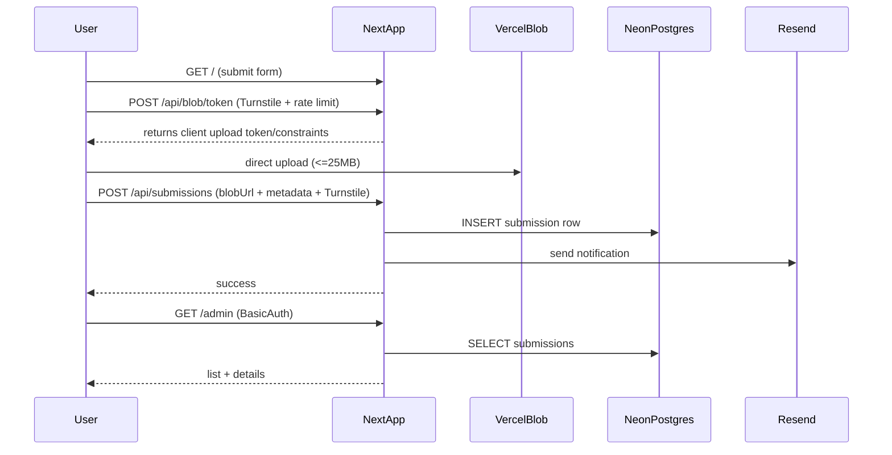

# Next.js tattoo upload portal (Vercel Blob + Neon + Resend)

## Goals

- Public form to upload tattoo drawings (images + PDF) to **Vercel Blob** with **25MB max**.
- Collect metadata: **name** and **body area** (plus optional notes).
- Store submission metadata in **Neon Postgres**.
- Simple **env-based admin login (Basic Auth-style)** to view all submissions.
- Send **Resend** email notification on each submission.
- Add **abuse prevention**: Cloudflare **Turnstile**, **rate limiting**, basic spam heuristics.

## Tech choices (based on your answers)

- **Next.js App Router** + **Tailwind**
- **Vercel Blob** for file storage
- **Neon Serverless driver** (`@neondatabase/serverless`) for DB access
- **Plain SQL migrations** committed to repo
- **Cloudflare Turnstile** on the public submit form
- **Admin auth**: single username/password from env; gate `/admin` and admin APIs

## High-level data flow

## Repository scaffolding

- Create Next.js project using `create-next-app` with Tailwind enabled.
- App Router pages:
  - `app/page.tsx`: public submit form
  - `app/success/page.tsx`: confirmation
  - `app/admin/page.tsx`: admin list view
  - `app/admin/[id]/page.tsx`: admin detail view

## Database (Neon)

- Add minimal SQL migration(s) in something like [`migrations/001_create_submissions.sql`](/Users/sam/development/projects/loyd-family/josh/tattoo/migrations/001_create_submissions.sql).
- Table `submissions` (example columns):
  - `id uuid primary key default gen_random_uuid()`
  - `created_at timestamptz default now()`
  - `name text not null`
  - `body_area text not null`
  - `notes text null`
  - `file_url text not null`
  - `file_path text not null` (blob pathname)
  - `file_size_bytes integer not null`
  - `file_content_type text not null`
  - `ip_hash text null` (privacy-preserving hashed IP + salt)
  - `user_agent text null`
  - `status text not null default 'new'`

## Vercel Blob upload

- Use a server route to generate client upload parameters and enforce constraints:
  - MIME allowlist: `image/png`, `image/jpeg`, `image/webp`, `application/pdf`
  - Max size: **25MB**
- Ensure server-side validation still happens on final submission (never trust client-only checks).

## Admin auth (env-based)

- Implement Basic Auth gate:
  - Protect `/admin` routes (middleware) and any admin API routes.
  - Env vars: `ADMIN_USER`, `ADMIN_PASS`.

## Resend notification

- Server-side email send in the submission handler:
  - Env vars: `RESEND_API_KEY`, `NOTIFY_EMAIL_TO`, `NOTIFY_EMAIL_FROM`.
  - Include submission metadata and a link to admin detail view.

## Abuse prevention

- **Turnstile**: verify token server-side on both:
  - upload-token endpoint and submission endpoint
- **Rate limiting**:
  - Basic per-IP (or ip-hash) sliding window using Neon (a small `rate_limits` table) or in-memory fallback for dev.
- **Spam hardening**:
  - Honeypot hidden field
  - Minimum form completion time check
  - Reject repeated identical payload bursts
  - Strict content-type + size enforcement

## Environment variables

- `DATABASE_URL` (Neon)
- `BLOB_READ_WRITE_TOKEN` (Vercel Blob)
- `ADMIN_USER`, `ADMIN_PASS`
- `RESEND_API_KEY`, `NOTIFY_EMAIL_FROM`, `NOTIFY_EMAIL_TO`
- `TURNSTILE_SECRET_KEY`, `NEXT_PUBLIC_TURNSTILE_SITE_KEY`
- `IP_HASH_SALT`

## Testing checklist

- Upload png/jpg/webp/pdf at small size succeeds; >25MB is rejected.
- Turnstile missing/invalid is rejected.
- Rate limit triggers after N attempts.
- Submission inserts into Neon.
- Resend email fires.
- `/admin` prompts for auth and lists submissions.