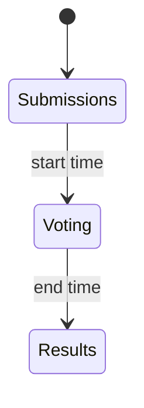

# Public Tattoo Vote - Plan

## Goal Capsule

- **Objective:** Let people vote once for a favourite tattoo from the shortlist Josh publishes, with a start and end, hidden totals until the end, and checks that make a second vote hard.
- **Product authority:** This plan owns that single public vote. It does not reopen submissions after the result, and it does not add another poll later.
- **Open blockers:** None.

## Product Contract

### Summary

Josh puts any number of tattoos that were already submitted onto one ballot and sets a start and an end. When the start time arrives, the homepage becomes that ballot. A vote counts only after the voter proves they received the email, and they cannot change the pick. Until the end, only the full admin sees totals. After the end, the homepage shows every winner, including a tie, and each design's count.

### Problem Frame

Designs are already in the portal, and the public page promises a vote after a shortlist. Admin star ratings are a private sort, not a public choice. Without a ballot that resists extra inboxes and extra devices, a loud few can outvote everyone else, and showing a running total would turn the vote into a pile-on.

### Key Decisions

- **One homepage poll.** (session-settled: user-directed — chosen over a separate vote page: the homepage is the ballot while the poll is on.) Governs R1, R2, R3.
- **No public ballot before the start.** (session-settled: user-directed — chosen over a teaser with the designs: signed-in admins preview it, and the public site keeps taking submissions.) Governs R2, R4, R16.
- **One locked favourite.** (session-settled: user-directed — chosen over changing a pick or ranking the list: name, email, and a single design.) Governs R6, R7, R8.
- **Proof is a link from the inbox.** (session-settled: user-directed — chosen over counting the form submit: the choice locks at submit, and a later email can be sent for that same choice.) Governs R7, R8.
- **Same browser, IP, or fingerprint cannot vote twice.** (session-settled: user-directed — chosen over accepting a second email and flagging it: a shared connection loses.) Governs R10.
- **Alias rules.** (session-settled: user-directed — chosen over treating dotted Gmail addresses as one person: plus-tags fold away, Gmail and Googlemail are one inbox, dots stay, disposable inboxes are rejected.) Governs R9.
- **Public result is counts and winners.** (session-settled: user-directed — chosen over a winner with no counts, and over naming voters: a tie lists every tied design.) Governs R13, R14.
- **Shortlist and end time stay editable after the start.** (session-settled: user-directed — chosen over freezing them: removing a design drops it from the public result, and the vote log remains.) Governs R5, R15.
- **Limited admin picks designs and previews.** (session-settled: user-directed — chosen over no voting access: counts, voter name and email, dates, and voids stay on the full admin.) Governs R16, R17, R18.
- **A voided vote stops counting.** (session-settled: user-directed — chosen over a permanent counted vote: the log stays, and that identity cannot vote again.) Governs R12, R18.
- **Each visitor sees a different design order.** (session-settled: user-directed — chosen over one fixed order.) Governs R11.
- **After the end, the homepage stays on the result and submissions stay closed.** Governs R3, R13.

### Actors

- A1. Voter. Any person with an email address that passes the checks.
- A2. Full admin. Sets the schedule, sees live totals and voter details, and voids a vote.
- A3. Limited admin. Adds and removes ballot designs and previews the ballot. Does not see counts or voter name and email.
- A4. Mail delivery. Carries the confirmation link to the address the voter entered.

### Requirements

**Schedule and homepage**

- R1. The public homepage is the ballot from the start time until the end time, and new tattoo submissions are refused for that whole window.
- R2. Before the start time, the public homepage keeps accepting submissions, and there is no public ballot. A signed-in admin can preview the ballot.
- R3. From the end time onward, the public homepage shows the result and keeps refusing new submissions.

**Ballot**

- R4. Only tattoos already submitted, and explicitly put on the ballot, appear. Josh can put on as many as he wants. The card shows the image and the explanation. It does not show the submitter's name, email, or body area.
- R5. Designs can be added or removed after voting has started. A removed design leaves the public ballot and the public result. Its vote rows stay in the admin log.

**Casting a vote**

- R6. A voter enters their name and email and picks one design.
- R7. The choice locks when the form is accepted. It cannot be changed. The vote does not count until the voter opens the confirmation link and confirms it, and only if that confirmation happens before the end time.
- R8. If the email was never confirmed, the voter can ask for another link to that same locked choice.

**Abuse controls**

- R9. The address is normalised before it is stored or compared. Text after a plus sign in the local part is removed. `gmail.com` and `googlemail.com` are the same inbox. Dots in the local part are kept. Disposable inboxes are rejected.
- R10. A second attempt from the same browser cookie, the same IP address, or the same browser fingerprint is rejected even when the email is different. The vote log stores the IP, the device cookie, the browser fingerprint, and the user agent.
- R11. While voting is open, the public order of designs is shuffled and differs by visitor.
- R12. The full admin can void a vote. A voided vote does not count. The log row remains, and that email, cookie, IP, and fingerprint cannot be used to vote again.

**Result and privacy**

- R13. After the end time, the public page shows each remaining design's counted votes and marks every design that shares the highest count as a winner. A count of zero produces no winner.
- R14. Before the end time, vote totals and voter identities are absent from every public page, including the preview. After the end time, the public result still omits voter names and emails.

**Admin**

- R15. The full admin sets the start and end. The end can change after voting has started. The start can change only before voting has started. Times are UK local time.
- R16. The limited admin and the full admin can preview the ballot and can add or remove designs. The preview shows the public ballot, with no totals.
- R17. The limited admin cannot see vote totals, voter names, or voter emails.
- R18. The full admin can see totals during and after the poll, can see each voter's name, email, and logged signals, and can void a vote.

### Key Flows

- F1. Publish the ballot
  - **Trigger:** Josh is ready to choose the tattoos.
  - **Actors:** A2, A3
  - **Steps:** An admin puts designs on the ballot. The full admin sets a start and an end. Either admin opens the preview and sees image, explanation, and a shuffled order, with no totals.
  - **Outcome:** The public site still takes submissions until the start time.
  - **Covers R2, R4, R15, R16.**
- F2. Cast a vote
  - **Trigger:** The current time is inside the window.
  - **Actors:** A1, A4
  - **Steps:** The homepage shows the ballot in that visitor's order. The voter submits name, email, and one design. The choice locks and an email is sent. The voter opens the link and confirms before the end time.
  - **Outcome:** The vote counts. The public page still shows no totals.
  - **Covers R1, R6, R7, R11, R14.**
- F3. Ask for the link again
  - **Trigger:** The confirmation email did not arrive, or the link no longer works.
  - **Actors:** A1, A4
  - **Steps:** The voter asks for another email. The locked design stays the same. A new confirmation email is sent.
  - **Outcome:** Confirming that link counts the original choice. A different design is refused.
  - **Covers R7, R8.**
- F4. Read the result
  - **Trigger:** The end time has passed.
  - **Actors:** A1, A2
  - **Steps:** The homepage shows the counted votes and every tied winner. The full admin can still open the log and void a vote, which changes the public counts.
  - **Outcome:** Voter names stay off the public page. Submissions stay closed.
  - **Covers R3, R12, R13, R14, R18.**

### Acceptance Examples

- AE1. Before the start, the public site still submits
  - **Covers R2, R1.**
  - **Given:** Designs are on the ballot and the start time is in the future.
  - **When:** A visitor opens the homepage and submits a tattoo.
  - **Then:** The submission is accepted, and the ballot is not shown.
- AE2. The window takes the homepage
  - **Covers R1, R4, R14.**
  - **Given:** The current time is after the start and before the end.
  - **When:** A visitor opens the homepage.
  - **Then:** They see only shortlisted images and explanations, in a shuffled order, and no vote totals. A new submission is refused.
- AE3. Plus-tags and Googlemail are one inbox
  - **Covers R9.**
  - **Given:** `josh+a@gmail.com` already has a locked choice.
  - **When:** Someone tries to vote as `josh@googlemail.com`.
  - **Then:** The second vote is refused. `j.osh@gmail.com` is still a different inbox.
- AE4. A second device signal is refused
  - **Covers R10.**
  - **Given:** A counted or pending vote already stored this visitor's cookie, IP, or fingerprint.
  - **When:** A different email is submitted from that same signal.
  - **Then:** The vote is refused.
- AE5. The choice survives a new email
  - **Covers R7, R8.**
  - **Given:** A pending vote exists for design A.
  - **When:** That same normalised email asks for another link, or tries to submit design B.
  - **Then:** Another link is sent for design A, and design B is refused.
- AE6. Confirmation after the end does not count
  - **Covers R7, R3.**
  - **Given:** A vote is still pending when the end time passes.
  - **When:** The voter opens the link and tries to confirm.
  - **Then:** The vote stays uncounted, and the homepage shows the result.
- AE7. A tie
  - **Covers R13, R14.**
  - **Given:** Two designs have 4 counted votes and a third has 1, and the end time has passed.
  - **When:** A visitor opens the homepage.
  - **Then:** Both designs with 4 are marked as winners, all three counts are visible, and no voter name is visible.
- AE8. Removing a design
  - **Covers R5, R13.**
  - **Given:** A design on the ballot has counted votes.
  - **When:** An admin removes it.
  - **Then:** It disappears from the public ballot and the public result. The full admin can still see its vote rows.
- AE9. Limited admin
  - **Covers R16, R17.**
  - **Given:** A limited admin is signed in during the window.
  - **When:** They open the ballot tools and the preview.
  - **Then:** They can add or remove a design and can see the public ballot. Totals, voter names, and voter emails are not on those pages.
- AE10. Void
  - **Covers R12, R18.**
  - **Given:** A counted vote is in the log.
  - **When:** The full admin voids it.
  - **Then:** It no longer adds to the public count, the row remains, and that email and device cannot vote again.

### Scope Boundaries

- Voters cannot change a pick.
- Voter names and emails are not published.
- The submission form does not stay up during the vote, and it does not return after the result.
- Body area and the submitter's name are not on the ballot.
- This is one poll, not a series of later rounds.
- A second person on a shared IP, browser, or fingerprint is not given a way past R10.

### Dependencies / Assumptions

- The ballot is chosen from tattoos already stored as submissions.
- Full admin and limited admin are the two existing admin sign-ins. The limited sign-in already hides submitter name and email, and R17 extends that to voters.
- Confirmation email uses the site's existing outbound mail.
- The public form keeps the existing human-check and rate limit used on submissions.
- Schedule times are Europe/London.

### Sources / Research

- `web/src/app/page.tsx` already promises a public vote after a shortlist.
- `web/src/auth.ts` defines the full and limited admin roles.
- `migrations/001_create_submissions.sql` and `migrations/004_add_explanation_and_rating.sql` are the submission record the ballot draws from. There is no vote table yet.
- `web/src/lib/ip.ts` already hashes IPs, and `web/src/lib/rateLimit.ts` already limits public writes.
